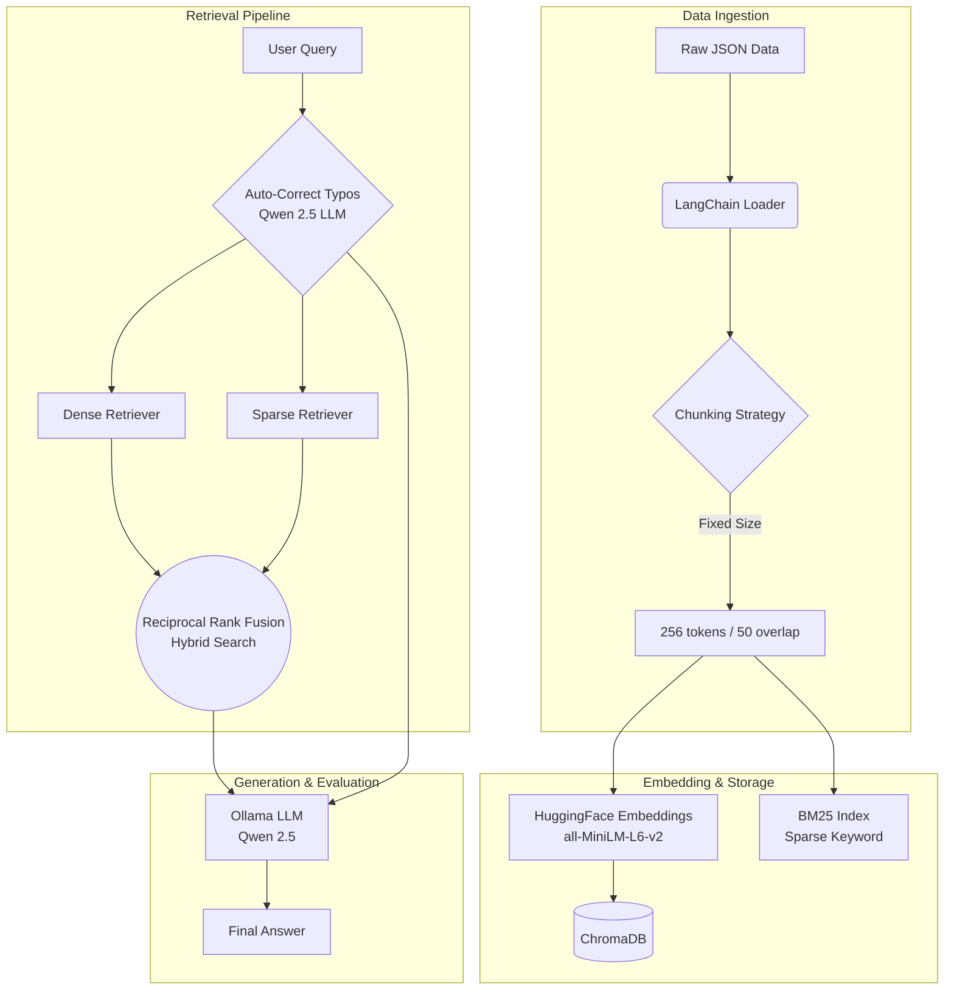
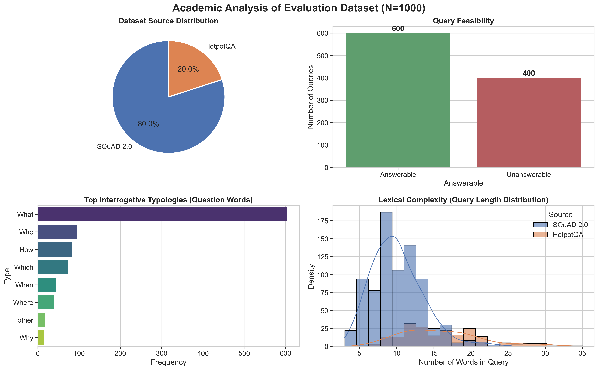
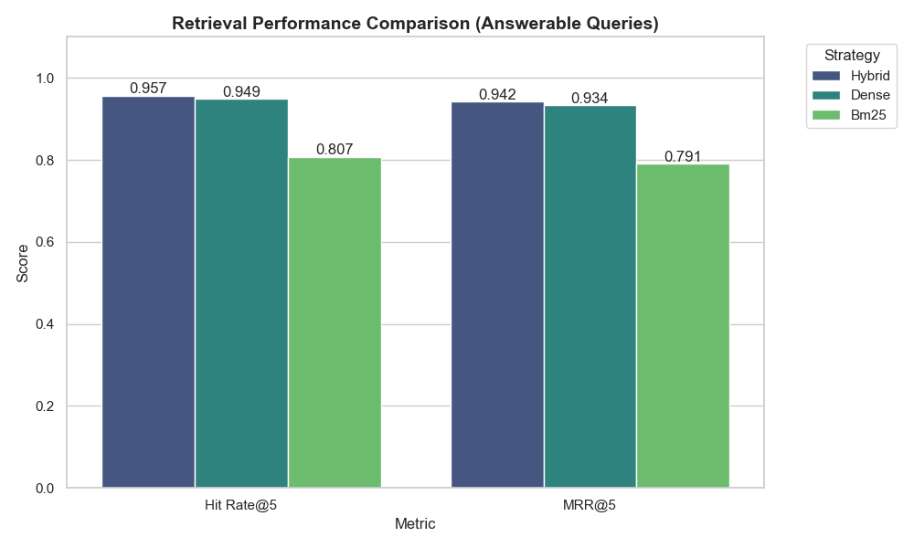
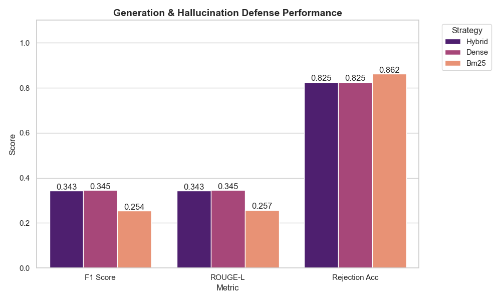
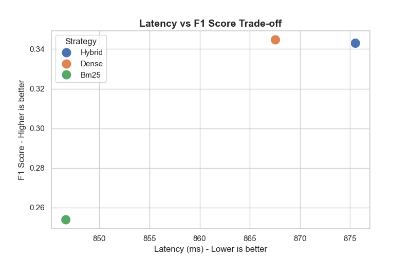
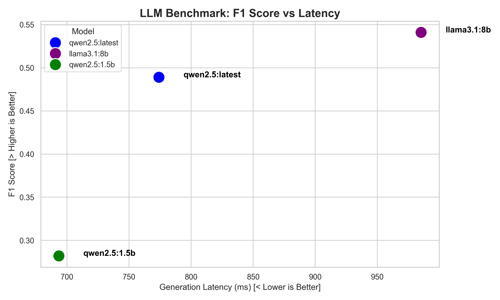

# Advanced Hybrid RAG Pipeline (Local)

An enterprise-grade Retrieval-Augmented Generation (RAG) pipeline built with LangChain, ChromaDB, and Ollama. This project demonstrates a complete end-to-end RAG architecture with Hybrid Search (Dense + Sparse) and Local LLM generation.

## Key Features

- **Local LLM Integration**: Fully private, local generation using [Ollama](https://ollama.com/) (Qwen2.5:1.5B/7B/14B).
- **Hybrid Retrieval System**: Combines semantic search (ChromaDB + HuggingFace Embeddings) with keyword search (BM25) using Reciprocal Rank Fusion (RRF).
- **LLM-Powered Auto-Correction**: Pre-processes raw user queries using a lightweight LLM inference pass to correct typos, grammar, and slang before retrieval, maximizing vector similarity match rates.
- **Dynamic Configuration**: Fully driven by `config/config.yaml` to easily swap chunking strategies, embedding models, and LLMs without changing code.
- **Fail-safe Logging**: Comprehensive logging using `loguru` and incremental batch saving to prevent data loss during long evaluation runs.

---

## Architecture Diagram



---

## Project Structure

```text
├── config/
│   └── config.yaml             # Central configuration file
├── data/
│   ├── raw/                    # Original raw datasets
│   └── processed/              # Chunked corpus & QA evaluation sets
├── notebooks/
│   ├── 01_pipeline_demo.ipynb  # Local testing & prototyping
│  
├── src/
│   ├── embedding/              # ChromaDB vector store builder
│   ├── generation/             # Ollama LLM integration
│   ├── retrieval/              # Dense, BM25, and Hybrid logic
│   └── utils/                  # Helper scripts
└── README.md
```

---

## Setup & Installation (Local)

### Quick Start
To get the complete RAG Evaluation Lab running on your local machine in under 5 minutes:

1. **Clone & Install Dependencies**
```bash
git clone <repository-url>
cd Rag_LLM_pipline
pip install -r requirements.txt
```
*(Ensure `langchain-huggingface`, `langchain-chroma`, and `streamlit` are installed)*

2. **Pull Local LLMs (Ollama)**
```bash
ollama pull qwen2.5:latest
ollama pull llama3.1:8b
```

3. **Launch the Interactive UI**
```bash
streamlit run app.py
```
The application will be available at `http://localhost:8501`.

### Interactive Streamlit Demo
The repository includes a robust interactive dashboard (`app.py`) designed to empirically test the RAG architecture.

*(Note: Insert your demo video here)*
<div align="center">
  <video src="PLACEHOLDER_VIDEO_URL" width="800" controls loop autoplay></video>
</div>

---


## Evaluation Dataset Characteristics (N=1,000)

To ensure an objective and rigorous academic evaluation, our test suite comprises 1,000 distinct queries sampled from two benchmark datasets: **SQuAD 2.0** (Stanford Question Answering Dataset) and **HotpotQA** (Multi-hop Question Answering).



### Key Academic Features of the Dataset:
1. **Unanswerable Traps (Hallucination Checks):** 40% of the SQuAD data consists of unanswerable "trick" questions. These queries share high lexical overlap with the context but inquire about altered details (e.g., wrong dates or entities). This rigorously tests the LLM's **Faithfulness** and **Rejection Accuracy**, ensuring the system gracefully outputs "I don't know" rather than hallucinating.
2. **Multi-hop Reasoning:** 20% of the dataset originates from HotpotQA. These queries require the retriever to fetch multiple distinct documents to synthesize a single answer (e.g., retrieving Document A to find a person's employer, and Document B to find the employer's headquarters).
3. **Interrogative Diversity:** The dataset features a wide distribution of query types (`What`, `Who`, `Where`, `How`, `Why`), demanding that the retriever handle both simple factoid extraction and complex reasoning-based retrieval.

---


## Large-Scale Evaluation Results (1,000 Samples)

We evaluated the performance of three retrieval strategies across 1,000 QA pairs (800 SQuAD, 200 HotpotQA) against a corpus of over 8,000 chunks. **All strategies were augmented with a Cross-Encoder Reranker** for a fair comparison of their maximum potential.

### Retrieval Performance


### Generation & Hallucination Defense Performance


### Latency vs Quality Trade-off


### Large Language Model Benchmark (50 Samples)
A direct comparison of model parameter scale versus retrieval quality utilizing the identical hybrid infrastructure.


### Advanced Query Routing (Trade-off Analysis)
To optimize production performance, we implemented a heuristic Query Router that dynamically routes simple FACTOID questions to the faster BM25 retriever, while reserving the heavy Hybrid + Reranker pipeline for complex MULTI_HOP queries.

**Results (50 samples):**
* **Without Router (Always Hybrid + Reranker):** F1 Score = `0.322` | Avg Latency = `994.4 ms`
* **With Router (Dynamic Selection):** F1 Score = `0.277` | Avg Latency = `828.1 ms`

**Conclusion:** Dynamic routing successfully reduced latency by **~16.7%**, but at the cost of a **13.9% reduction** in F1 score due to bypassing the Reranker for factoid queries. Given our prioritization of absolute accuracy over minimal latency, **the final configuration keeps the Query Router OFF by default**, relying strictly on the maximum-accuracy Hybrid strategy.

### Key Engineering Takeaways:
1. **The Reranker is Not a Silver Bullet (Garbage In = Garbage Out):** A Cross-Encoder reranker can only reorder what the primary retriever finds. Because BM25 struggled to retrieve semantically relevant chunks from the large corpus, the reranker could not salvage its performance.
2. **Chunking Severely Impacts BM25:** Breaking down long documents into 512-token chunks caused keywords and actual answers to be separated. BM25 frequently retrieved chunks that contained keyword matches but lacked the semantic context required to answer the question.
3. **Chunking is Essential for Dense Retrieval:** Conversely, chunking solved "Semantic Dilution" for the Dense retriever. By embedding smaller, focused segments, the Dense retriever achieved a near-perfect Hit Rate.
4. **Hybrid Retrieval is the Golden Standard:** Combining Dense and BM25 provides the most diverse pool of candidates. At a large scale, Hybrid maintains the highest Hit Rate (95.7%), ensuring the Reranker has the best possible options to select from.

---
*Engineered for rigorous RAG performance evaluation.*
